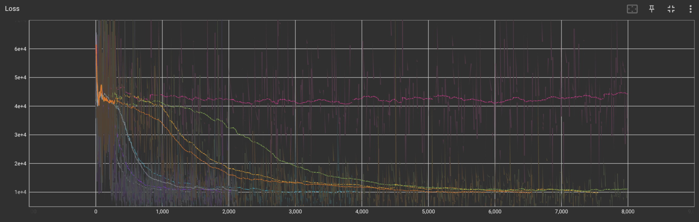
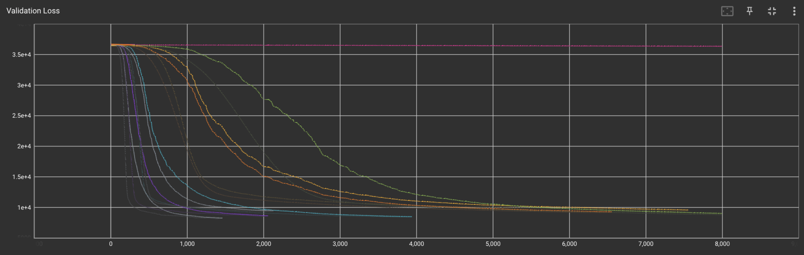
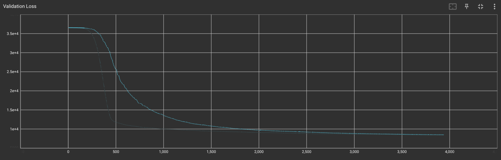

# Modelling airbnbs listings dataset

In this project I was given access to a uncleaned dataset (listing.csv in the data/tabular_data folder). The task is therefore to perform exploratory data analysis, clean the data and process it and seperate features from labels in a structured way.

I will then perform a regression task and classification task. For the regression, the features will include: number of beds, number of bedrooms, number of bathrooms, number of guests, Cleanliness_rating, Accuracy_rating, Communication_rating, Location_rating, Check-in_rating, Value_rating, amenities_count and the target variable is the nightly price for the Airbnb; therefore there are 11 features.

In the classification task, the features will include: number of beds, number of bedrooms, number of bathrooms, number of guests, nightly price, Cleanliness_rating, Accuracy_rating, Communication_rating, Location_rating, Check-in_rating, Value_rating, amenities_count and the label is the Category of the listing (which is one of 5: Treehouse, Chalet, Amazing pools, offbeat, beachfront); therefore 12 features.

First sklearn will be used to train and test a variety of machine learning models for each case and the best one will be picked after cross validation based on the validation root mean squared error (regression) and validation accuracy score (classification).

Finally a configurable neural network will be created using PyTorch and a hyperparameter dictionary to be able to test different architectures for the regression case. Then the same process will be repeated for a classification case where the label is now the number of bedrooms and the category is included in the features (12 features).

## Data preparation
### Tabular data
- In the tabular_data file I have created functions to clean the airbnb table data. The functions could be reused for similar tabular data. The tabular data has 988 samples and 20 columns as seen when using `df.info()`:


- The output from `df.head()` is seen below:


- Three key steps were completed to clean the tabular data.
    - The first was to remove the rows in which the rating data was missing. The first line in the function is to remove the 'Unamed: 19' column which contains only null values which was created in reading the csv due to an error of an extra comma in the csv file. The function:
    ```
    def remove_rows_with_missing_ratings(df_null):
        df_null = df_null.iloc[:,:-1]
        df = df_null.dropna(subset=['Cleanliness_rating', 'Accuracy_rating', 'Communication_rating', 'Location_rating', 'Check-in_rating', 'Value_rating'])
        return df.copy()
    ```
    - The second was to fix the description column. The problem with this column was that each element contained a list in the form of a string (i.e. "[...]"). Therefore the literal_eval function from the ast module was used to turn these values into lists. Then a string was created from the list so that the description is a single string. The function:
    ```
    def description_func(x):
        ls = literal_eval(x)
        ls.remove('About this space')
        if '' in ls:
            ls.remove('')
            return ''.join(ls)
        else:
            return ''.join(ls)

    def combine_description_strings(df):
        df = df.copy().dropna(subset={'Description'})
        df['Description'] = df['Description'].apply(description_func)
        return df.copy()
    ```
    - The third step is to set default values for certain columns where there are missing values. The function: 
    ```
    def set_default_feature_value(df):
        df[['guests', 'beds', 'bathrooms', 'bedrooms']] = df[['guests', 'beds', 'bathrooms', 'bedrooms']].fillna(1)
        return df.copy()
    ```

### Images
- The images for the airbnb property samples were prepared in the prepare_image_data.py file. In this file the images were downloaded from the cloud (an s3 bucket from AWS) and placed in a folder. The function used to do this is seen below:
```
def download_images():
    s3 = boto3.resource('s3')

    my_bucket = s3.Bucket('erikharaldson-airbnb-listing-images')

    for file in my_bucket.objects.all():
        s3_filename = file.key
        s3_filename_split = s3_filename.split('/')

        if len(s3_filename_split) == 3:   # This ignores the objects which are empty folders
            cwd = os.getcwd()
            folder_name = 'images/' + s3_filename_split[1]
            final_directory = os.path.join(cwd, folder_name)

            if not os.path.exists(final_directory):
                os.makedirs(final_directory)

            filepath = os.path.join(final_directory, s3_filename_split[2])
            with open(filepath, 'wb') as data:
                my_bucket.download_fileobj(s3_filename, data)
```
- The images are then processed to all have the same height as the image with the smallest height in the entire dataset while keeping the aspect ratio of each image constant. The function used to do this is seen below:
```
def resize_images():
    cwd = os.getcwd()
    directory = os.path.join(cwd, 'images')
    walk = os.walk(directory)
    _, subdirectories, _ = next(walk)

    images = []

    for subdirectory in subdirectories:
        subdirectory_path = os.path.join(directory, subdirectory)
        _, _, files = next(os.walk(subdirectory_path))

        for file in files:
            image = Image.open(os.path.join(subdirectory_path, file))
            if image.mode == 'RGB':
                images.append((subdirectory+'/'+file, image, image.size[0], image.size[1]))    # File path, image, image width, image height

    heights = [x[-1] for x in images]
    min_height = min(heights)

    for image in images:
        change_in_height = image[-1] / min_height
        new_image = image[1].resize((round(image[-2]/change_in_height), min_height))
        file_path = image[0].split('/')
        processed_img_dir = os.path.join(cwd, 'data/processed_images/' + file_path[0])
        if not os.path.exists(processed_img_dir):
            os.makedirs(processed_img_dir)
        new_image.save(os.path.join(processed_img_dir, file_path[1]))
```

## Regression
### Linear Regression

- In this section of the project I am fitting a linear regression model to the airbnb dataset to predict nightly price. 

- A first baseline model was created as a simple sklearn linear regression model without regularization which produced a root mean squared error of 115.95 on the validation dataset.

- After this a grid search over the hyperparameters: penalty, alpha and max_iter was completed using sklearn's GridSearchCV module. This grid search therefore looked at both Linear regression models with no regularization, L1 regularization, and L2 regularization. The best model produced from this Cross-Validation search was a Ridge regression model with alpha = 0.1 and 100000 iterations. The mean RMSE score on the validation sets was 102.43, this result was better than that without regularization which is to be expected since the regularization increases the generalization of the model.

- The best linear regression model and its score metrics were saved in files in the model/regression/linear_regression folder to be able to compare to future models. 

- The RMSE score however is very high and it gave only and R^2 score of ~0.445 which is not a very good fit. Therefore, I hope to see an improvement when looking at other regression models (non-linear).

### All regression models

- After running a simple linear regression model it is now time to test other regression techniques.

- To do this the following models were looked at:
    - SGDRegressor()
    - AdaBoostRegressor()
    - GradientBoostingRegressor()
    - RandomForestRegressor()
    - DecisionTreeRegressor()
    - LinearSVR()
    - SVR()

- A cross validation over some important hyperparameters was conducted on each model. The models, metrics and best hyperparameters were saved in individual folders.

- Finally a function was created to find the best model from each of the best models of each algorithm with the best hyperparameters.

- The best model and its hyperparameters was a random forest regressor as seen below...

```
RandomForestRegressor(max_depth=100, 
                      max_features='sqrt', 
                      min_samples_leaf=2,
                      n_estimators=20)
```

- For this model the mean validation RMSE (Root Mean Squared Error) was 99.33. This is better than the linear regression model but is still quite low.

- There are more regression models I would like to look at such as: bayesian regression which has not been looked at in the notes and also neural networks (which will ultimately be used later one)

### All classification models

- To test out different classification models, I looked at the numerical data from before and used the 'Category' column of the dataset as the output label. This label consists of different categories of listing such as treehouse and chalet. 

- The classification models that were looked at:
    - LogisticRegression()
    - KNeighborsClassifier()
    - GradientBoostingClassifier()
    - RandomForestClassifier()
    - DecisionTreeClassifier()
    - LinearSVC()
    - SVC()
    - GaussianProcessClassifier()

- A similar process was carried out as before by comparing the best cross validated model but in this case, the mean validation accuracy score was used to compare models.

- The best classification model was found to be:

```
GradientBoostingClassifier(max_depth=1,
                           min_samples_leaf=5)
```

- For this model the mean validation accuracy score is 0.401. This accuracy is better than logistic regression which achieved a mean validation accuracy score of 0.389 but it is still quite low and would not constitute a usable model. The model is clearly better than a random guesser; which since there are 5 classes would tend to achieve an accuracy score of 0.2, however it is still a very low accuracy. Hopefully the neural network used later on will be able to achieve better scores than the classifier models used so far.

- In the future I would like to look more at using a neural network for classification as well as a Naive Bayes classification model.

### Neural networks
## Regression

- To get familiar with neural networks, I have made functions so that I can pass in the hyperparameters for a neural network: epochs, learning rate, model depth and layer widths. With these configuration settings the code creates a neural network with the correpsonding layers (which are all linear in this case) and ReLU activations after each layer.

- From early testing of different architectures and hyperparameters it became clear that the Adam optimiser with a learning rate of 0.0001 worked a lot better than SGD in reducing the validation RMSEs.

- To get an idea of which architectures to look at I decided to test architectures by adding a layer each time until the network was overfitting (showing that it is probably to complex) and reduced the number of layers by 2; to look at networks with around 7 layers and varying number of nodes in each layer. 

- I created 8 different architectures for possible neural networks. In turn, each model was trained on the same train data and the root mean squared error and r^2 score were calculated for the train, validation and test set but only the validation rmse was used to compare the models.

- In order to prevent overfitting when testing the different architectures I implemented a function to be able to conduct an early stop when the validation loss started to increase. The function works simply by checking if the current validation loss is above the average over the past x batch indices:

```
def early_stopping(validation_losses, stop_criteria = 200):
    if len(validation_losses) > stop_criteria:
        average = np.mean(validation_losses[-stop_criteria:])
        if average < validation_losses[-1]:
            print(average, validation_losses[-1])
            return True
        else:
            return False
    else:
        return False
```

- The loss function used when training all the models was the mean squared error. The following is a tensorboard plot of the loss for all the runs:



- I thought it would be interesting to plot the validation loss aswell to see if a model would start to overfit and the following is the validation set's loss for all models:



- The model with the best validation score was 7 layer network with the nodes at each hidden layer being: 128, 512, 128, 64, 32, 16.

- The training and validation loss for this architecture is plotted below:




- The root mean squared error for this architecture was 91.17 for the validation set and 101.25 for the test set. The R^2 values were 0.416 and 0.097 respectively. 

- Whilst this is an improvement on any regression model tested so far, it is still a bad model and would not be useful in a real setting. Seeing as no model has been able to predict the nightly price with any accuracy it may be that the features picked out for these calculations are not useful for this task and there should be some reworking done to select better features.

## Classification
- To experiment with classification using neural networks the dataset that was used had the normal numerical features from before with the addition of the category feature (which was originally the target for the sklearn classification models) which has been one hot encoded (and 1 column dropped). The lable for this dataset is the number of bedrooms for the listing.

- The same methodology as in the regression case was used; this led to a decision to test 16 architectures of 5 and 6 layers (all linear with a ReLU activation and ended with a SoftMax layer). The accuracy and f1 score for the train, validation, and test data sets was calculated for each model and the validation set accuracy score was used to pick the best model.

- The train and validation loss for all the architectures is plotted below:


- The best model architecture had a depth of 5 layers with the hidden layers having a depth of: 128, 256, 64, 32. This model achieved a accuracy score of 0.887 on the train set and 0.887 on the validation set with corresponding f1 scores (`sklearn.metrics.fi_score(..., average='macro', multiclass='ovr)); 0.416 and 0.567.

- The train and validation loss for this model is plotted below:


- This model shows very good performance on the validation data set and is likely a very good model to use for this task.

- Compared to the previous classification task that was looking at a different label (Category) for the data set; this classification model was a lot better than the different sklearn models. The reason for this is likely due to the features available which include: beds, bathrooms, nightly price, and several different ratings. These features do not have enough predicting power for the category label which includes: treehouses, chalets, Amazing pools, offbeat, beachfront. However when predicting the number of bedrooms, features like the number of beds and bathrooms as well as nighlty price will have higher predicting powers.

- One thing to note is that the dataset is very unbalanced with 1 bedroom being the label for 61% and 1 and 2 bedrooms together make up 84% of the dataset.